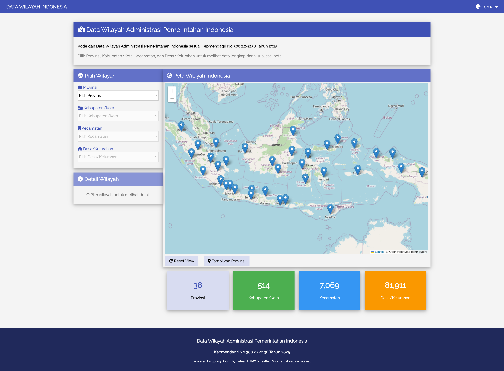
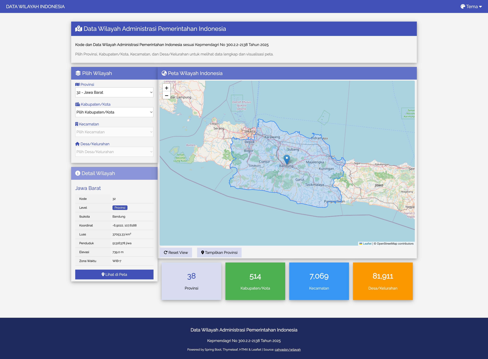
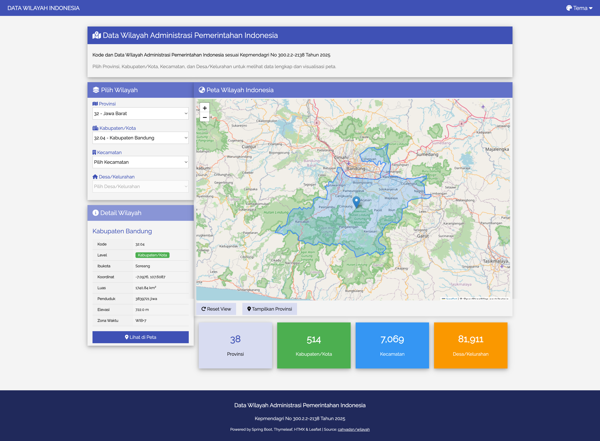
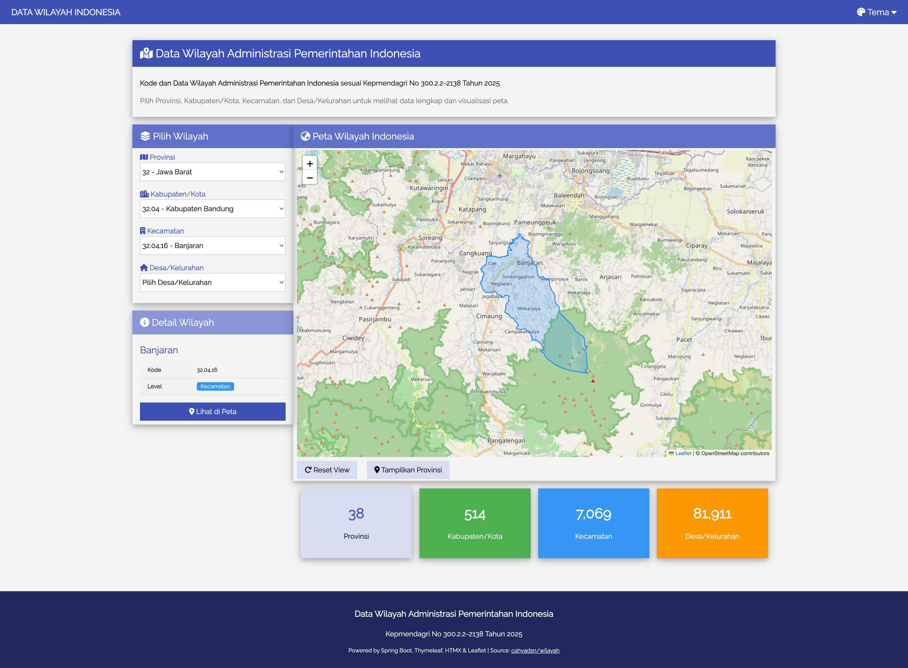
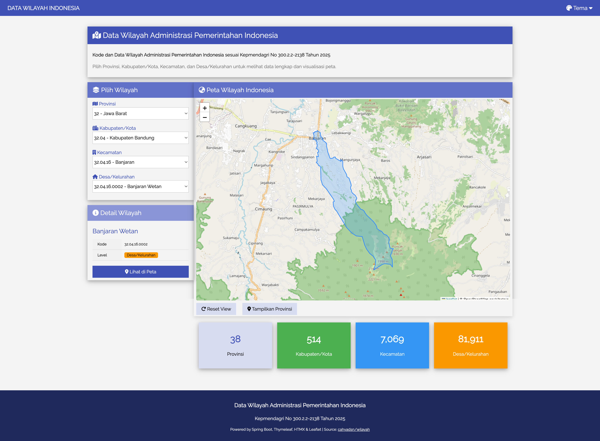
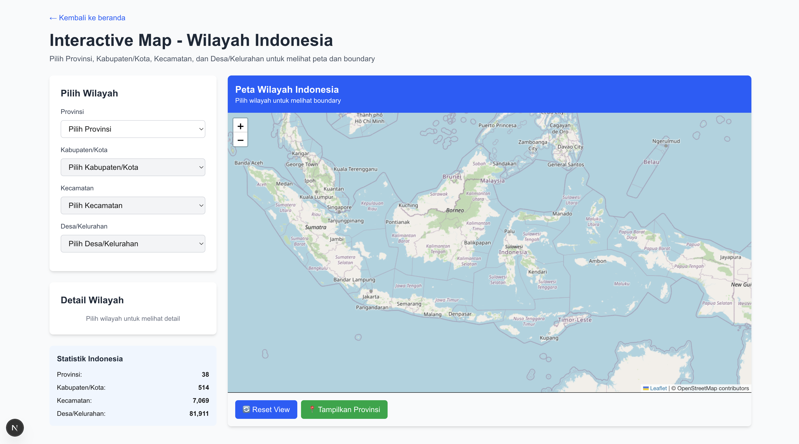
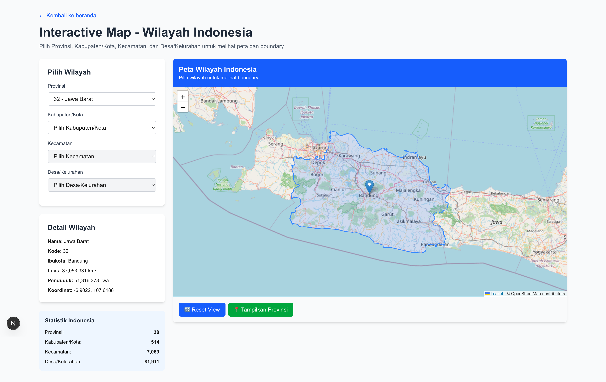
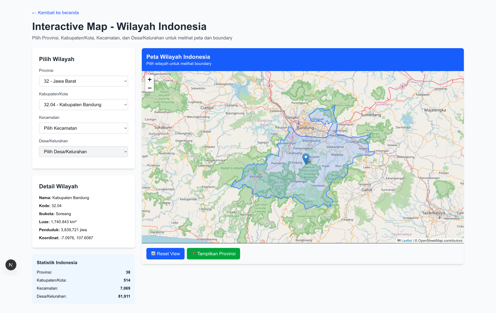
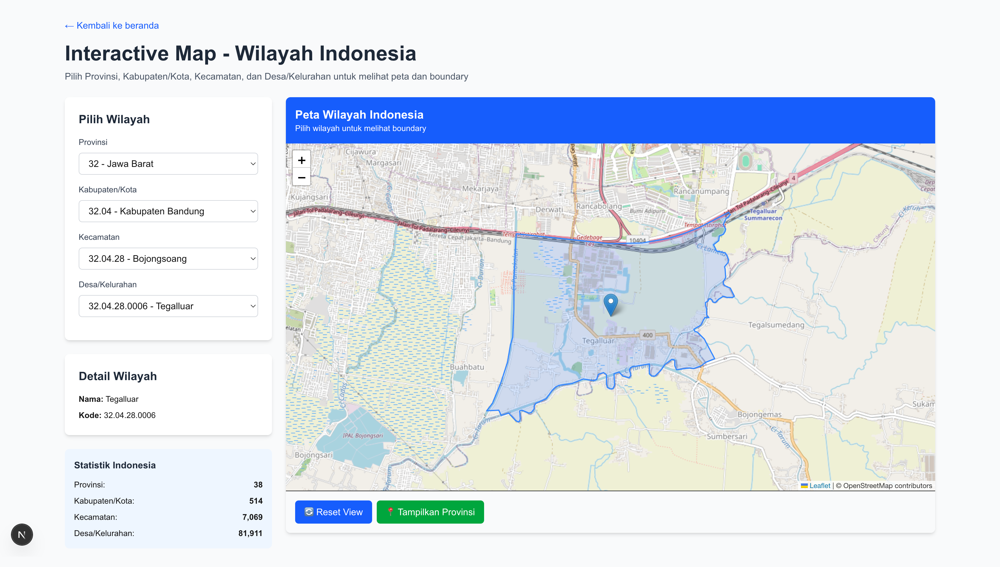

# Indonesia Map & Boundaries

[](https://github.com/hendisantika/indonesia-map/actions/workflows/maven-build.yml)


A comprehensive Spring Boot application for exploring Indonesia's administrative boundaries with interactive map visualization using Thymeleaf and HTMX.

## Features

### Core Features
- **4-Level Administrative Hierarchy**: Complete data for Provinsi → Kabupaten/Kota → Kecamatan → Desa/Kelurahan
- **Interactive Map with Boundaries**: Leaflet-based map showing GeoJSON boundary polygons for all levels
- **Dual Frontend Options**:
  - **Thymeleaf + HTMX**: Server-side rendering with dynamic updates
  - **Next.js + React**: Modern SPA with client-side rendering
- **Cascading Dropdowns**: Dynamic selectors that load dependent regions automatically
- **Boundary Visualization**: Real-time boundary display for all 87,068+ administrative regions
- **Coordinate Format Conversion**: Automatic conversion between GeoJSON and Leaflet coordinate formats
- **RESTful API**: JSON endpoints for boundary data retrieval
- **Flyway Database Migrations**: Versioned schema management with Git LFS for large datasets
- **Responsive Design**: Mobile-friendly interface

### Next.js Frontend Features
- **Modern React Architecture**: Built with Next.js 14+ and TypeScript
- **Client-Side Map Rendering**: Optimized Leaflet integration with dynamic imports
- **Smart Coordinate Handling**: Automatic detection and conversion of coordinate formats by administrative level
- **Loading States**: Smooth UX with loading indicators and disabled states during map initialization
- **Error Handling**: Graceful fallbacks for missing boundary data or coordinates
- **Real-time Boundary Display**: Instant polygon rendering with auto-zoom to selected regions
- **Tailwind CSS**: Modern, utility-first styling framework

## Technology Stack

### Backend
- **Spring Boot**: 4.0.1
- **ORM**: Spring Data JPA, Hibernate
- **Database**: MySQL 9.5.0 with spatial data (GeoJSON)
- **Migration**: Flyway with Git LFS for large SQL files
- **Build Tool**: Maven
- **API**: RESTful endpoints with CORS support

### Frontend Options

#### Thymeleaf + HTMX (Server-Side)
- **Template Engine**: Thymeleaf with Layout Dialect
- **Dynamic Updates**: HTMX 2.0.3
- **Styling**: W3.CSS Framework
- **Map Library**: Leaflet 1.9.4

#### Next.js + React (Client-Side)
- **Framework**: Next.js 14+ (App Router)
- **Language**: TypeScript
- **UI Library**: React 18+
- **Styling**: Tailwind CSS
- **Map Library**: Leaflet 1.9.4 with React integration
- **HTTP Client**: Axios
- **Build Tool**: Turbopack (Next.js)

### Infrastructure
- **Containerization**: Docker Compose
- **Version Control**: Git with Git LFS for large files
- **CI/CD**: GitHub Actions

## Prerequisites

- **Java 25** (JDK 25 or higher)
- **MySQL 9.5.0** (or compatible version)
- **Maven 3.9+**
- **Docker & Docker Compose** (recommended)
- **Git LFS** (for cloning large migration files)

## Quick Start with Docker Compose

1. **Clone the repository** with Git LFS:
```bash
git clone https://github.com/hendisantika/indonesia-map.git
cd indonesia-map
git lfs pull
```

2. **Start MySQL container**:
```bash
docker compose up -d
```
This starts MySQL 9.5.0 on port **13306** with:
- Database: `wilayah_indo3`
- Username: `yu71`
- Password: `53cret`

3. **Build and run the application**:
```bash
mvn clean spring-boot:run
```

The first run will execute Flyway migrations to populate 87,068 administrative regions (this may take several minutes due to large datasets).

4. **Access the application**:
- **Thymeleaf Frontend**: http://localhost:8080
- **Next.js Frontend**: http://localhost:3000/interactive (see Next.js setup below)

## Running the Next.js Frontend

The project includes a modern Next.js frontend with enhanced interactive features.

1. **Navigate to frontend directory**:
```bash
cd frontend
```

2. **Install dependencies**:
```bash
npm install
```

3. **Start development server**:
```bash
npm run dev
```

4. **Access the Next.js app**:
- **Interactive Map**: http://localhost:3000/interactive
- Features real-time boundary rendering for all administrative levels

The Next.js frontend automatically connects to the Spring Boot backend API running on port 8080.

## Database Setup (Manual)

If not using Docker Compose, set up MySQL manually:

1. **Install MySQL 9.5.0** or compatible version

2. **Create database and user**:
```sql
CREATE DATABASE wilayah_indo3;
CREATE USER 'yu71'@'localhost' IDENTIFIED BY '53cret';
GRANT ALL PRIVILEGES ON wilayah_indo3.* TO 'yu71'@'localhost';
FLUSH PRIVILEGES;
```

3. **Update database connection** in `src/main/resources/application.properties`:
```properties
spring.datasource.url=jdbc:mysql://localhost:3306/wilayah_indo3
spring.datasource.username=yu71
spring.datasource.password=53cret
```

Note: Change port from `13306` to `3306` if using local MySQL instead of Docker.

## Flyway Migrations

The project includes comprehensive Flyway migration scripts managed with **Git LFS** due to large file sizes:

### Migration Files Structure

- **V1**: Create `wilayah_level_1_2` table (for Provinsi and Kabupaten)
- **V2-V8**: Insert Level 1-2 data by region
  - V2: Sumatera (10 provinces, 126 regencies)
  - V3: Jawa-Bali (7 provinces, 120 regencies)
  - V4: Nusa Tenggara (3 provinces, 43 regencies)
  - V5: Kalimantan (5 provinces, 56 regencies)
  - V6: Sulawesi (6 provinces, 82 regencies)
  - V7: Maluku (2 provinces, 20 regencies)
  - V8: Papua (5 provinces, 66 regencies)

- **V9.0-V9.8**: Level 3 boundaries (Kecamatan - 4,606 districts)
  - V9.0: Create `wilayah_level_3_boundaries` table with geometry
  - V9.1-V9.7: Insert district GeoJSON data by region
  - V9.8: Normalize district codes

- **V10.0-V10.8**: Level 4 boundaries (Desa/Kelurahan - 81,911 villages)
  - V10.0: Create `wilayah_level_4_boundaries` table with geometry
  - V10.1-V10.7: Insert village GeoJSON data by region
  - V10.8: Normalize village codes

- **V11**: Create boundary verification views
- **V12**: Create unified `wilayah_level_3_4` table with JSON coordinate arrays
- **V13**: Populate Level 3 (Kecamatan) from geometry data - converts MySQL geometry to JSON
- **V14**: Populate Level 4 (Desa) from geometry data - extracts GeoJSON coordinates

### Data Statistics

- **38** Provinces (Provinsi)
- **513** Regencies/Cities (Kabupaten/Kota)
- **4,606** Districts (Kecamatan)
- **81,911** Villages/Sub-districts (Desa/Kelurahan)
- **Total**: 87,068 administrative regions with boundary data

## API Endpoints

### Web Pages

- `GET /` - Thymeleaf home page with interactive map and cascading selectors
- `GET /interactive` (Next.js) - React-based interactive map page

### HTMX Endpoints (Fragment Rendering)

These endpoints return HTML fragments for the Thymeleaf frontend:

- `GET /wilayah/kabupaten-select/{provinsiKode}` - Load kabupaten dropdown for selected province
- `GET /wilayah/kecamatan-select/{kabupatenKode}` - Load kecamatan dropdown for selected kabupaten
- `GET /wilayah/desa-select/{kecamatanKode}` - Load desa dropdown for selected kecamatan

### REST API v1 (Legacy)

- `GET /wilayah/api/boundary/{kode}` - Get GeoJSON boundary coordinates for a specific region
  - **Example**: `/wilayah/api/boundary/31` (DKI Jakarta province)
  - Returns: `{ "coordinates": [...], "level": "Provinsi|Kabupaten|Kecamatan|Desa" }`

### REST API v2 (Used by Next.js Frontend)

All v2 endpoints are prefixed with `/api/v2/wilayah` and return JSON data:

**Region Listing:**
- `GET /api/v2/wilayah/provinsi` - Get all provinces
- `GET /api/v2/wilayah/provinsi/{provinsiKode}/kabupaten` - Get kabupaten by province
- `GET /api/v2/wilayah/kabupaten/{kabupatenKode}/kecamatan` - Get kecamatan by kabupaten
- `GET /api/v2/wilayah/kecamatan/{kecamatanKode}/desa` - Get desa by kecamatan

**Region Details:**
- `GET /api/v2/wilayah/{kode}` - Get region details by code
- `GET /api/v2/wilayah/{kode}/boundary` - Get boundary data with GeoJSON coordinates
  - **Example**: `/api/v2/wilayah/32` (Jawa Barat province)
  - **Example**: `/api/v2/wilayah/32.04` (Bandung kabupaten)
  - **Example**: `/api/v2/wilayah/32.04.28` (Bojongsoang kecamatan)
  - **Example**: `/api/v2/wilayah/32.04.28.0002` (Bojongsoang desa)
  - Returns: `{ "kode": "...", "nama": "...", "level": "...", "lat": ..., "lng": ..., "coordinates": "[[[...]]]" }`

**Search:**
- `GET /api/v2/wilayah/search?keyword={query}` - Search regions by name

**All CORS-enabled** for frontend integration

## Usage Guide

### Interactive Map with Cascading Selectors

1. **Select Province (Provinsi)**:
   - Choose a province from the first dropdown
   - The map automatically zooms to the province boundary
   - Province boundary polygon is displayed in blue

2. **Select Regency (Kabupaten/Kota)**:
   - After selecting a province, the kabupaten dropdown loads automatically
   - Choose a kabupaten to see its boundary on the map
   - The map zooms to the kabupaten area

3. **Select District (Kecamatan)**:
   - The kecamatan dropdown loads for the selected kabupaten
   - Select a kecamatan to view its boundary
   - Map updates to show the kecamatan polygon

4. **Select Village (Desa/Kelurahan)**:
   - The desa dropdown loads for the selected kecamatan
   - Select a desa to see its detailed boundary
   - Map centers on the village area

5. **Theme Customization**:
   - Click the theme button to choose from 12 color schemes
   - Themes persist across page reloads

### Map Features

- **Interactive Boundaries**: Click polygons for region information
- **Auto-zoom**: Map automatically centers on selected region
- **Coordinate Display**: View latitude/longitude for each region
- **GeoJSON Visualization**: All boundaries rendered from GeoJSON data

## HTMX Features

The application uses HTMX 2.0.3 for seamless, dynamic content updates:

- **Cascading Selectors**: Automatic loading of dependent dropdowns via `hx-get` and `hx-trigger`
- **Fragment Swapping**: Only updates necessary DOM sections (dropdowns, map boundaries)
- **Out-of-Band Swaps**: Multiple DOM updates from a single request
- **JavaScript Integration**: Custom handlers for province/kabupaten/kecamatan/desa selection
- **Loading States**: Visual feedback during HTMX requests

## Coordinate Format Conversion

The application intelligently handles different coordinate formats stored in the database for different administrative levels:

### Database Storage Format

- **Provinsi/Kabupaten** (Levels 1-2):
  - Format: `[[[lat, lng]]]` (Leaflet-compatible)
  - Structure: 2-level nesting (polygon → points)

- **Kecamatan/Desa** (Levels 3-4):
  - Format: `[[[[lng, lat]]]]` (GeoJSON format from MySQL ST_AsGeoJSON)
  - Structure: 3-level nesting (polygon → rings → points)

### Automatic Conversion (Next.js Frontend)

The React/TypeScript implementation automatically:
1. **Detects administrative level** from API response
2. **Handles different nesting levels**:
   - Provinsi/Kabupaten: Direct polygon processing
   - Kecamatan/Desa: Extract first ring from polygon structure
3. **Swaps coordinates** for kecamatan/desa from `[lng, lat]` to `[lat, lng]`
4. **Calculates center points** from polygon bounds when lat/lng are missing in database
5. **Auto-zooms** map to fit boundary polygons with padding

### Legacy Conversion (Thymeleaf Frontend)

JavaScript helper functions in the Thymeleaf version:
1. Detect coordinate format by checking array depth
2. Identify if coordinates need swapping (longitude > 90 for Indonesia)
3. Convert GeoJSON `[lng, lat]` to Leaflet `[lat, lng]` format
4. Handle nested arrays for complex polygons

This dual-approach ensures all 87,068+ administrative boundaries render correctly across both frontends.

## Project Structure

```
indonesia-map/
├── frontend/                          # Next.js Frontend
│   ├── src/
│   │   ├── app/
│   │   │   ├── interactive/
│   │   │   │   └── page.tsx          # Interactive map page
│   │   │   ├── layout.tsx
│   │   │   └── page.tsx
│   │   ├── components/
│   │   │   ├── ErrorMessage.tsx
│   │   │   └── Loading.tsx
│   │   ├── lib/
│   │   │   ├── api.ts                # API client for backend
│   │   │   └── leaflet-icon-fix.ts   # Leaflet icon path fix
│   │   └── types/
│   │       └── wilayah.ts            # TypeScript interfaces
│   ├── package.json
│   ├── tsconfig.json
│   └── tailwind.config.ts
│
├── src/main/                          # Spring Boot Backend
│   ├── java/id/my/hendisantika/indonesiamap/
│   │   ├── controller/
│   │   │   ├── HomeController.java
│   │   │   ├── WilayahController.java
│   │   │   └── WilayahApiV2Controller.java  # REST API
│   │   ├── entity/
│   │   │   ├── WilayahLevel12.java
│   │   │   └── BoundaryData.java
│   │   ├── repository/
│   │   │   └── WilayahRepository.java
│   │   ├── service/
│   │   │   └── WilayahService.java
│   │   └── IndonesiaMapApplication.java
│   └── resources/
│       ├── db/migration/              # Flyway migrations
│       │   ├── V1_*.sql through V14_*.sql
│       │   └── README files
│       ├── templates/                 # Thymeleaf templates
│       │   ├── fragments/
│       │   │   ├── wilayah-list.html
│       │   │   └── wilayah-detail.html
│       │   ├── index.html
│       │   ├── map.html
│       │   └── layout.html
│       └── application.properties
│
├── img/                               # Screenshots
│   ├── home.png
│   ├── provinsi.png
│   ├── kabupaten.png
│   ├── kecamatan.png
│   └── kelurahan.png
├── compose.yaml
├── pom.xml
└── README.md
```

## Development

### Continuous Integration

The project uses **GitHub Actions** for automated builds:

- **Workflow**: `.github/workflows/maven-build.yml`
- **Triggers**: Push to `main` branch and pull requests
- **Steps**:
  1. Checkout repository with Git LFS
  2. Set up JDK 25 (Temurin distribution)
  3. Verify compilation with Maven
  4. Package application (skip tests for CI speed)
  5. Verify JAR creation

### Git LFS (Large File Storage)

SQL migration files are tracked with Git LFS due to large sizes:

- **Total LFS data**: 832 MB across 31 SQL files
- **Tracked pattern**: `src/main/resources/db/migration/*.sql`
- **Setup**: `.gitattributes` configures LFS tracking
- **Clone**: Use `git lfs pull` after cloning to download large files

### Hot Reload

The project includes Spring Boot DevTools for automatic restart on code changes.

### Thymeleaf Cache

Thymeleaf cache is disabled in development for instant template updates:
```properties
spring.thymeleaf.cache=false
```

## Data Attribution

This project uses data from:
- **Humanitarian Data Exchange (HDX)**: Indonesia Administrative Boundaries (COD-AB)
- **BPS (Badan Pusat Statistik)**: Indonesian Central Statistics Agency
- Reference: Kepmendagri No 300.2.2-2138 Tahun 2025

## License

This project is licensed under the MIT License.

## Author

Created by Hendi Santika
- Email: hendisantika@gmail.com
- Telegram: @hendisantika34

## Support

For issues and feature requests, please create an issue in the repository.

## Performance Notes

- **First Run**: Flyway migrations may take 5-10 minutes to populate 87,068 administrative regions with boundary data
- **Database Size**: Approximately 2-3 GB after all migrations complete
- **Memory**: Recommend at least 2 GB RAM for MySQL container
- **Git LFS**: Ensure Git LFS is installed before cloning to download large SQL files (832 MB)

## Screenshots

### Thymeleaf + HTMX Frontend

Home Page



Provinsi Page



Kabupaten/Kota Page



Kecamatan Page



Kelurahan Page



### Next.js Interactive Map Frontend

Interactive Map - Loading State



Interactive Map - Provinsi Boundary



Interactive Map - Kabupaten Boundary



Interactive Map - Kecamatan Boundary


Interactive Map - Desa Boundary



## Technical Highlights

✨ **Key Features**:
- 4-level cascading administrative hierarchy
- Real-time boundary visualization with GeoJSON
- Automatic coordinate format conversion (Leaflet ↔ GeoJSON)
- HTMX-powered dynamic UI without full page reloads
- W3.CSS responsive design with 12 themes
- Flyway versioned database migrations
- Git LFS for managing large datasets
- GitHub Actions CI/CD pipeline
- RESTful API for boundary data

---

**Repository**: https://github.com/hendisantika/indonesia-map
**Live Demo**: Run locally with Docker Compose at http://localhost:8080
